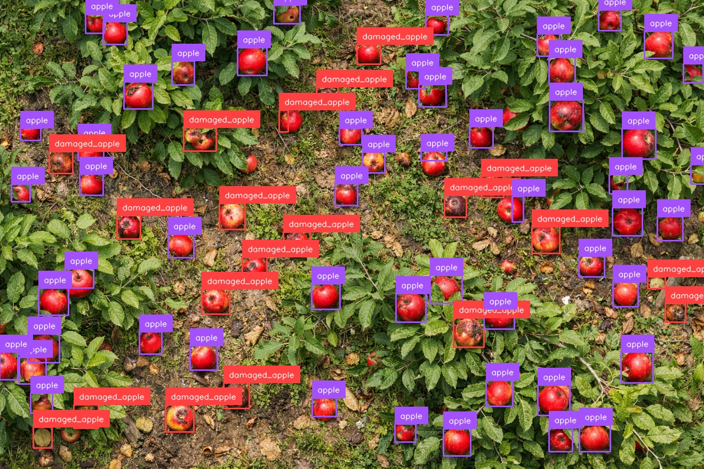
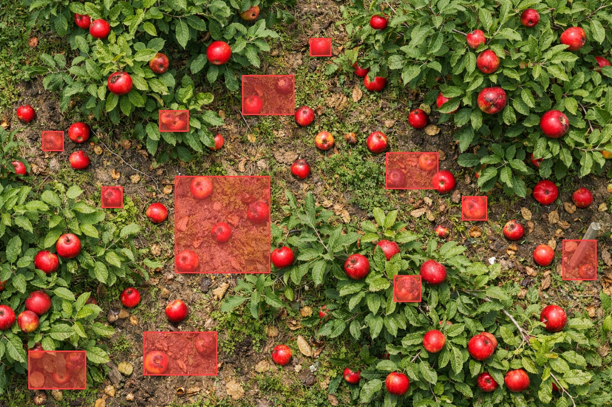
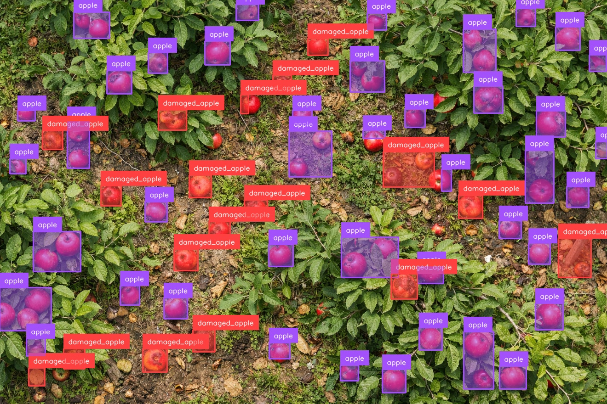
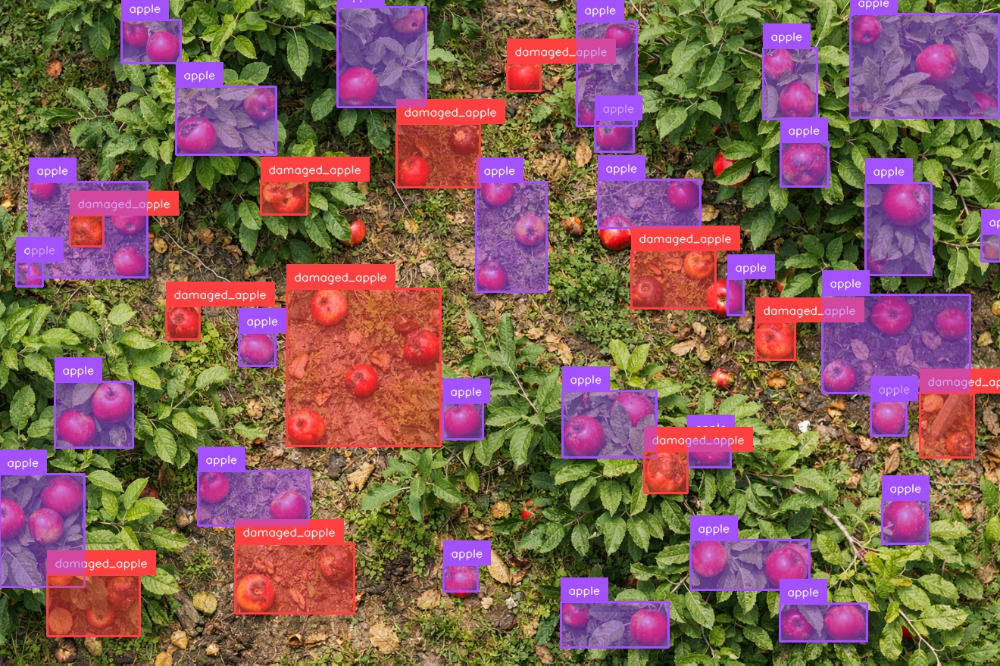
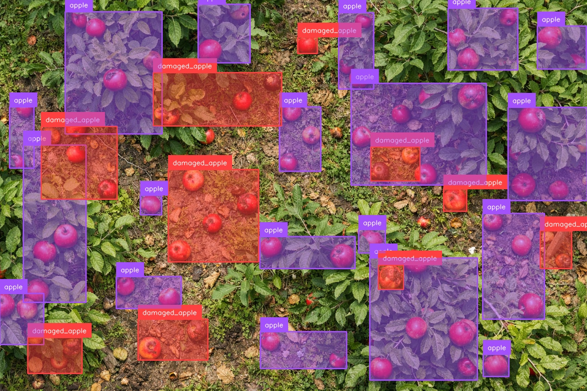
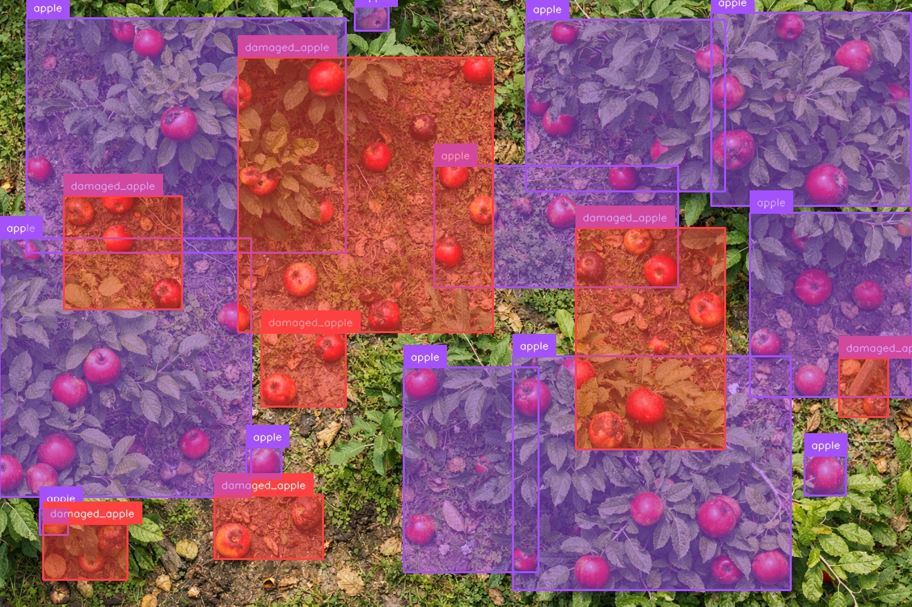
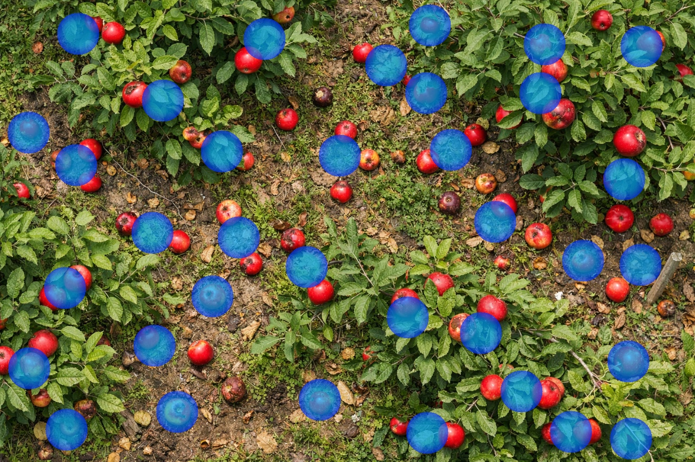
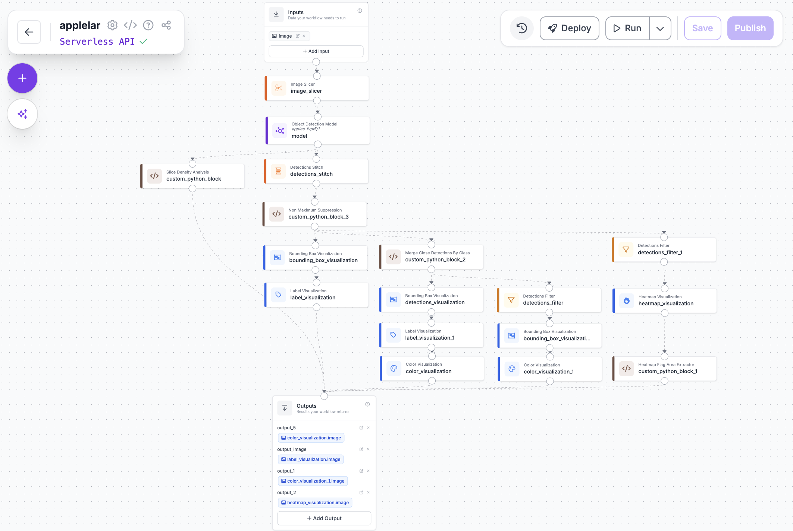

# orchard-eye

> Drone imagery → damaged apple detection → spatial treatment zones

**Built with:** Roboflow Workflows · Computer Vision · Precision Agriculture

🔗 **[cags-workspace/elma](https://app.roboflow.com/cags-workspace/workflows/edit/elma)**

A computer vision pipeline that converts **drone imagery of apple orchards into localized treatment zones**.

Instead of simply detecting fruit, the system analyzes **spatial clusters of damaged apples** to estimate where intervention is actually needed.

This project rebuilds part of my **Control and Automation Engineering graduation thesis** using **Roboflow Workflows** to explore how modern tooling simplifies real-world computer vision pipelines.

---

# Quick Overview

The pipeline converts raw drone imagery into **decision-oriented signals for orchard management**.

```
Drone Image
     ↓
Object Detection (apple / damaged_apple)
     ↓
Detection Stitching
     ↓
Spatial Clustering
     ↓
Treatment Zone Estimation
```

### Example Pipeline Result

| Input Image | Detection | Treatment Zones |
|-------------|-----------|-----------------|
|  |  |  |

The final output highlights **areas where disease signals cluster**, enabling **targeted spraying instead of uniform field treatment**.

---

# The Problem

Fruit diseases rarely spread uniformly across orchards.

They usually begin in **small localized clusters** before spreading outward.

However, many orchards still rely on **uniform spraying**, treating entire fields regardless of where infection actually exists.

This approach:

- wastes chemicals
- increases operational costs
- ignores spatial disease patterns

A vision system that maps **where disease signals concentrate** changes the decision from:

```
spray the entire field
```

to

```
spray these zones
```

---

# Model

Custom object detection model trained using **Roboflow**.

| Class | Description |
|------|-------------|
| **apple** | healthy fruit |
| **damaged_apple** | diseased fruit |

Apple vs damaged apple classification is used as a **proxy signal** to validate the spatial reasoning pipeline.

In real agricultural deployments, disease detection often focuses on **leaf pathology and plant morphology**, but fruit-level signals allow rapid validation of the full vision system.

---

# Detection Output

The model detects apples and damaged apples across aerial orchard imagery.


These detections form the **base signals used for clustering and treatment zone estimation**.

---

# Spatial Cluster Analysis

Object detection alone does **not answer the operational question:**

> **Where should treatment be applied?**

Individual detections represent isolated signals. In agricultural environments, disease presence becomes meaningful when detections appear **spatially grouped**.

The pipeline therefore performs **spatial clustering on bounding box coordinates**.

### Clustering Process

1. **Detection Stitching**  
   Predictions from sliced inference are mapped back into the original image coordinate space.

2. **Spatial Proximity Analysis**  
   Bounding box centers are compared using **Euclidean distance**.

3. **Cluster Formation**  
   Nearby detections are merged into **treatment zones**.

---

# Merge Threshold Comparison

Different clustering thresholds were evaluated to understand how spatial grouping affects treatment zone estimation.

### 80px merge



### 120px merge



### 180px merge



### 240px merge



---

# Optimal Treatment Zones

A merge threshold of **120 pixels** produced the most interpretable treatment regions.

This threshold balances two competing effects:

- small thresholds fragment clusters into many tiny zones  
- large thresholds merge distant detections into overly large regions  

The **120px merge distance** produced the clearest spatial grouping of damaged apples.


These zones represent areas **most likely to require intervention**.

---

# Disease Density Heatmap

In addition to clustering, the pipeline generates a **spatial heatmap** showing where damaged apple detections accumulate.



This visualization highlights **disease intensity across the orchard**.

---

# Quantitative Signals

Beyond visual outputs, the workflow extracts simple quantitative indicators describing orchard health.

### 1️⃣ Infection Ratio

```
damaged_apple / total_apple
```

Represents the **proportion of detected fruit that appears damaged**.

---

### 2️⃣ Disease Density Coverage

```
damaged_heatmap_area / total_field_area
```

Measures how much of the orchard contains **measurable disease density**.

---

### 3️⃣ Treatment Zone Coverage

```
merged_damaged_zone_area / total_field_area
```

Using the **120px merge threshold**, this metric estimates how much of the orchard **may require targeted intervention**.

Together these signals transform raw detections into **decision-oriented indicators for orchard management**.

---

# Roboflow Workflow Architecture



Key stages include:

- image slicing for large aerial imagery  
- object detection inference  
- detection stitching  
- spatial clustering via custom Python blocks  
- heatmap generation  
- quantitative signal extraction  

The workflow produces both **visual outputs** and **structured signals** describing orchard conditions.

Some parts of the pipeline are implemented using **custom Python blocks inside Roboflow Workflows**.

The Python logic used in those blocks is included in the `scripts/` directory for reference.

---

# Development Notes

Building a custom dataset was the first approach. Using my own orchard imagery, I began labeling and training a detection model from scratch.

The free plan introduced constraints that compounded quickly. Dataset updates required **restarting the training process entirely** rather than extending an existing model. If a model developed incorrect patterns during training, there was no path to correct it incrementally — only a full rebuild. Upload limits further restricted how fast the dataset could grow.

For a pipeline where the core problem is **spatial reasoning and treatment zone estimation** — not raw model performance — these constraints became the limiting factor before meaningful pipeline work could begin.

The solution was **Roboflow Universe**. Switching to an existing Apple Detection dataset removed the dataset infrastructure bottleneck entirely and allowed development effort to shift toward what the project is actually about: slicing high-resolution aerial imagery, stitching detections across slices, clustering spatial signals, and converting model outputs into localized treatment zones.

This also reflects a broader point about Roboflow Universe as an ecosystem: for applied computer vision projects where domain data is scarce or expensive to collect, the availability of pre-labeled datasets is a **meaningful accelerant**. The dataset bottleneck — historically one of the most time-consuming parts of building vision systems — can often be bypassed entirely.

---

# Background

This project originated as my **Control and Automation Engineering graduation thesis** focused on **precision agriculture systems**.

The original research pipeline included:

- **YOLOv4 models** trained on agricultural datasets  
- **multi-objective crop grading** based on disease and maturity signals  
- **optimization algorithms** (Genetic Algorithm + Big Bang–Big Crunch)  
- **MATLAB-based decision modeling**  
- **MQTT infrastructure** for transmitting field data  

While the system worked, building the full pipeline required significant engineering overhead.

Most development time was spent on:

- dataset collection and labeling
- training pipeline configuration
- large-image inference orchestration
- model infrastructure

rather than focusing on the **actual decision logic**.

This repository rebuilds the **vision layer using Roboflow Workflows** to evaluate how modern tooling reduces that overhead and allows development effort to focus on:

> **turning model outputs into actionable agricultural decisions**

---

# What This Project Demonstrates

This project explores how modern developer tooling can reduce the engineering overhead traditionally required to build computer vision systems.

In the original thesis implementation, a large portion of the effort went into building infrastructure before any meaningful inference could run. Dataset preparation pipelines, training configuration, large-image slicing, prediction stitching, and orchestration all had to be engineered manually.

Rebuilding the vision layer using **Roboflow Workflows** significantly simplified that process. Core components such as dataset management, model training, and large-image inference could be assembled much faster, allowing development time to shift away from infrastructure and toward **interpreting model outputs and designing decision logic**.

As a result, the pipeline focuses less on producing raw detections and more on generating **decision-oriented signals**. Instead of simply identifying objects, the system analyzes spatial patterns in the detections and converts them into interpretable treatment zones.

The goal is to move from a model that answers:

```
What objects are present?
```

to a system that helps answer the operational question:

```
Where should intervention happen?
```

---

## Observed Limitations

These are friction points encountered during development — not complaints, 
but honest observations from building on top of the platform.

**Slice stitching is opaque.**  
When detections from adjacent slices conflict at boundaries, the stitching 
behavior is difficult to inspect or adjust. There is no visibility into 
intermediate outputs at this stage, which made debugging significantly 
slower than expected.

**Python block execution environment is restrictive.**  
Custom Python blocks are the right mechanism for logic that doesn't fit 
the visual workflow — but dependency support is limited, error messages 
are often unclear, and publishing failures occur when runtime errors exist 
without surfacing exactly where. Better runtime feedback here would 
meaningfully improve iteration speed.

**Grid-based output requires leaving the platform.**  
Precision agriculture systems operate on spatial field grids, not irregular 
polygons. Translating clustered detections into grid coordinates required 
custom logic built entirely outside the Workflow environment. For 
agriculture-focused deployments specifically, native grid output support 
would close a meaningful gap.

---

# Future Work

Several extensions could make this system more applicable to real-world agricultural deployments.

One direction would be shifting from fruit-level detection to **leaf-level disease detection**, which typically provides stronger biological signals for identifying early-stage crop health issues.

Another improvement would involve translating clustered detections into **grid-based field recommendations**. Precision agriculture systems often operate on spatial grids rather than irregular clusters, enabling easier integration with field machinery and treatment planning.

Additional opportunities include integrating predictions with **automated spraying or irrigation systems**, allowing treatment decisions to be executed directly from the model outputs.

Finally, running the pipeline on **multi-temporal drone imagery** could allow the system to track how disease clusters evolve over time, enabling earlier intervention and better monitoring of treatment effectiveness.

These directions would move the system closer to a full **decision-support tool for precision agriculture**, where aerial imagery is not only analyzed but directly informs field-level management decisions.

---


# Dataset

This project does not include a local dataset.

The object detection model was built using an **Apple Detection dataset available on Roboflow Universe**.

Dataset:
https://universe.roboflow.com/roboflow-100/apples-fvpl5

The dataset was accessed directly through the Roboflow platform during training and inference inside the workflow.

Because the dataset is hosted on Roboflow Universe, it is not stored in this repository.


---


# Repository Structure

```
orchard-eye
│
├── README.md
├── LICENSE
├── requirements.txt
│
├── assets/images        # visuals used in the README
├── scripts              # Python logic used inside Roboflow workflow blocks
├── data                 # dataset documentation
└── outputs              # generated pipeline outputs
```

This structure separates **documentation assets, workflow logic, and generated outputs** to keep the repository organized and reproducible.

---

## Closing

This project started as a question: how much of the engineering overhead 
from my thesis could modern tooling eliminate?

The answer is: most of it.

Dataset management, model training, and inference orchestration — the parts 
that consumed the majority of development time in the original system — are 
no longer the hard parts. Roboflow moves the engineering effort forward, 
closer to the actual problem.

The hard parts that remain are not platform problems. They are engineering 
problems: multi-parameter optimization, decision modeling across competing 
signals, translating spatial detections into actionable field recommendations. 
In the original thesis, these were addressed through Genetic Algorithm and 
Big Bang–Big Crunch optimization across water ratio, maturity, and disease 
variables simultaneously. That layer sits outside what any vision platform 
provides — and outside what this demo attempts.

This pipeline is a demo. But the thinking behind it isn't.
